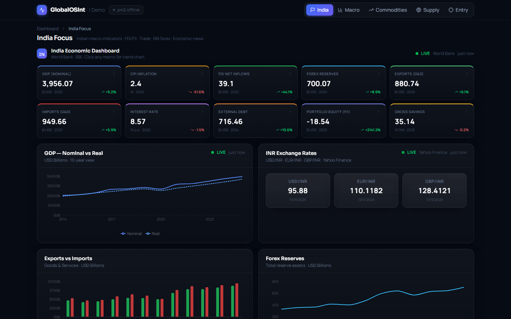
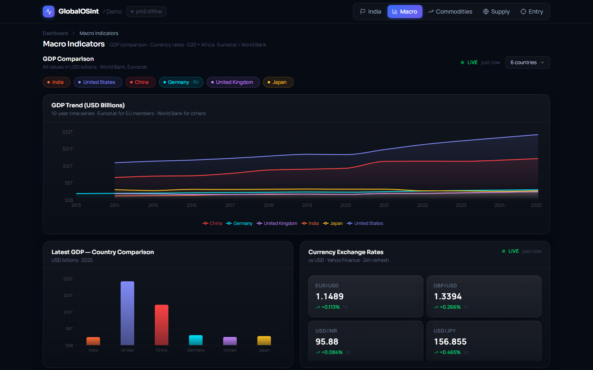
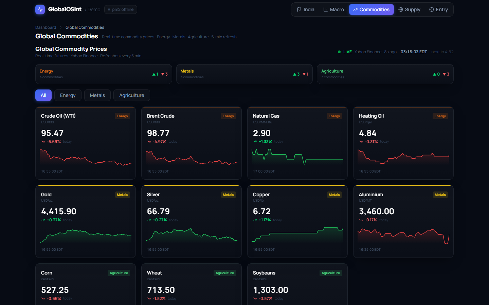

# GlobalOSInt Demo

An interactive geopolitical intelligence dashboard that visualises global industrial production, macroeconomic indicators, India-focused economic data, and real-time commodity pricing — built with React, Recharts, and Vite.




<table>
  <tr>
    <td></td>
    <td></td>
  </tr>
</table>

---

## Table of Contents

- [Overview](#overview)
- [Tech Stack](#tech-stack)
- [Project Structure](#project-structure)
- [Architecture](#architecture)
- [Dashboard Views](#dashboard-views)
- [Data Sources & APIs](#data-sources--apis)
- [Components](#components)
- [PM2 Sidecar API](#pm2-sidecar-api)
- [Getting Started](#getting-started)
- [API Keys](#api-keys)
- [PM2 Deployment](#pm2-deployment)
- [Vite Proxy Configuration](#vite-proxy-configuration)

---

## Overview

GlobalOSInt Demo is a single-page React application with four dashboard views:

| View | Contents |
|------|----------|
| **Global Supply & Production** | Industrial production stat cards for 6 G20 OECD economies, annual growth bar chart, monthly index line chart, interactive world map with supply chain routes |
| **Macro Indicators** | Customisable GDP comparison (Eurostat + World Bank, USD billions), multi-country selector across 21 nations, FOREX rates, financial market snapshot |
| **India Focus** | 10 macroeconomic metric cards with YoY growth markers, GDP/deflator/trade/FDI/inflation charts, INR exchange rates |
| **Global Commodities** | Real-time futures prices for 11 commodities (Energy, Metals, Agriculture), 5-minute auto-refresh, ET timestamps, category summary |

A live **PM2 badge** in the header polls a local sidecar API every 5 seconds to display the CPU usage, memory, uptime, and restart count of the managed process.

---

## Tech Stack

| Category | Library / Tool |
|----------|----------------|
| UI framework | React 19 |
| Build tool | Vite 8 |
| Styling | Tailwind CSS 4 (via `@tailwindcss/vite` plugin) |
| Charts | Recharts 3 |
| World map | react-simple-maps 3 |
| HTTP client | Axios |
| Icons | Lucide React |
| Process manager | PM2 7 |
| PM2 API server | Express 5 |

---

## Project Structure

```
├── src/
│   ├── App.jsx                       # Root layout, nav (4 views), PM2 badge, view routing
│   ├── main.jsx                      # React entry point
│   ├── index.css                     # Tailwind base styles
│   ├── components/
│   │   ├── SupplyProductionView.jsx  # Supply & Production dashboard view
│   │   ├── MacroIndicatorsView.jsx   # GDP comparison, FOREX, market snapshot
│   │   ├── IndiaFocusView.jsx        # India macroeconomic dashboard
│   │   ├── CommodityView.jsx         # Real-time global commodity prices
│   │   ├── WorldMap.jsx              # Interactive SVG world map with supply routes
│   │   ├── LiveStatus.jsx            # Online/offline indicator with last-updated time
│   │   ├── Skeleton.jsx              # Loading skeleton components
│   │   └── ErrorState.jsx            # Error display with retry button
│   ├── data/
│   │   └── supplyChainRoutes.js      # Static supply route definitions + risk colours
│   └── utils/
│       └── api.js                    # All external API fetch functions + ALL_COUNTRIES
├── pm2-api.cjs                       # Express sidecar — exposes /api/pm2
├── pm2-api.mjs                       # ESM mirror of the sidecar (alternative entry)
├── ecosystem.config.cjs              # PM2 app definition for the Vite dev server
├── vite.config.js                    # Vite config with dev-server proxies
├── package.json
└── index.html
```

---

## Architecture

```
Browser
  │
  ├─ /yahoo-finance/*   ──proxy──▶  query1.finance.yahoo.com     (FOREX, commodities, market tickers)
  ├─ /api/pm2           ──proxy──▶  127.0.0.1:3001               (PM2 sidecar)
  ├─ /eurostat-api/*    ──proxy──▶  ec.europa.eu                  (Eurostat GDP — EU countries)
  ├─ /imf-data/*        ──proxy──▶  dataservices.imf.org          (IMF IFS quarterly forex reserves)
  │
  └─ direct fetch
       ├─ api.db.nomics.world         (DBnomics — OECD KEI industrial production)
       ├─ api.worldbank.org           (World Bank — GDP, India macro indicators)
       └─ newsapi.org                 (NewsAPI — removed from UI, key retained in api.js)

PM2 sidecar  (pm2-api.cjs  port 3001)
  └─ connects to local PM2 daemon, lists processes, returns JSON
```

All proxied routes are Vite dev-server only. Yahoo Finance, Eurostat, and IMF bypass browser CORS restrictions through the proxy.

---

## Dashboard Views

### 1 — Global Supply & Production

- **Countries:** USA, Germany, Japan, United Kingdom, France, South Korea (G20 OECD members with OECD KEI data)
- **Data source:** DBnomics / OECD KEI `PRINTO01` monthly industrial production index
- **Charts:** Annual YoY growth bar chart (last 6 years) · Monthly index line chart (last 24 months)
- **Map:** Interactive supply chain routes with risk filtering and zoom/pan

### 2 — Macro Indicators

- **Country selector:** Multi-select dropdown across all 21 countries (G20 + Nigeria + Egypt). Default: India, USA, China, Germany, UK, Japan
- **GDP comparison:** USD billions time series (area chart) + latest-year bar chart
  - EU members (Germany, France, Italy): Eurostat `nama_10_gdp` → EUR converted to USD via live EUR/USD rate
  - All others: World Bank `NY.GDP.MKTP.CD`
- **FOREX panel:** 10 currency pairs (EUR/USD, GBP/USD, USD/INR, USD/JPY, USD/CNY, USD/BRL, USD/KRW, USD/AUD, USD/CAD, USD/ZAR) via Yahoo Finance · 24-hour cache
- **Market snapshot:** SPY, VIS, USO, CPER, UUP with 1-month sparklines

### 3 — India Focus

- **Metric cards (10):** GDP Nominal, CPI Inflation, FDI Net Inflows, Forex Reserves, Exports, Imports, Interest Rate, External Debt, Portfolio Equity (FII), Gross Savings — each with **YoY growth/decline marker** (▲/▼ + %)
- **Charts:** GDP Nominal vs Real · GDP Deflator `(Nominal/Real × 100)` · Exports vs Imports trade balance · FDI trend · CPI Inflation · Lending interest rate · Forex reserves
- **Forex reserves:** World Bank annual data supplemented with IMF IFS quarterly data (`1L_D_BP6_USD`) for 2024/2025 figures not yet published by World Bank
- **INR rates:** USD/INR · EUR/INR · GBP/INR via Yahoo Finance

### 4 — Global Commodities

- **Commodities (11):**

| Category | Commodities |
|----------|-------------|
| Energy | Crude Oil WTI (CL=F), Brent Crude (BZ=F), Natural Gas (NG=F), Heating Oil (HO=F) |
| Metals | Gold (GC=F), Silver (SI=F), Copper (HG=F), Aluminium (ALI=F) |
| Agriculture | Corn (ZC=F), Wheat (ZW=F), Soybeans (ZS=F) |

- **Refresh:** Auto-refresh every 5 minutes · countdown timer in header
- **Timestamps:** All times shown in Eastern Time (EST/EDT auto-selected based on DST) via `Intl` API with `timeZone: 'America/New_York'`
- **Category summary:** Gainers/losers count per category

---

## Data Sources & APIs

### World Bank API

- **Base URL:** `https://api.worldbank.org/v2`
- **Indicators used:**

| Key | Indicator Code | Description |
|-----|---------------|-------------|
| GDP (nominal) | `NY.GDP.MKTP.CD` | Current USD |
| GDP (real) | `NY.GDP.MKTP.KD` | Constant USD |
| GDP deflator | `NY.GDP.DEFL.ZS` | Index |
| CPI inflation | `FP.CPI.TOTL.ZG` | Annual % |
| FDI net inflows | `BX.KLT.DINV.CD.WD` | Current USD |
| Portfolio equity | `BX.PEF.TOTL.CD.WD` | Current USD |
| Exports | `NE.EXP.GNFS.CD` | Current USD |
| Imports | `NE.IMP.GNFS.CD` | Current USD |
| Lending interest rate | `FR.INR.LEND` | % |
| Forex reserves | `FI.RES.TOTL.CD` | Current USD |
| Gross savings | `NY.GNS.ICTR.GN.ZS` | % of GNI |
| External debt | `DT.DOD.DECT.CD` | Current USD |
| Industry % of GDP | `NV.IND.TOTL.ZS` | % |

### Eurostat API (EU countries only)

- **Endpoint (proxied):** `/eurostat-api/eurostat/api/dissemination/statistics/1.0/data/nama_10_gdp`
- **Dataset:** `nama_10_gdp` · Unit: `CP_MEUR` (current prices, million EUR) · Item: `B1GQ` (GDP)
- Converted to USD billions using live EUR/USD rate from Yahoo Finance
- Applies to: Germany (DE), France (FR), Italy (IT)

### IMF IFS API (forex reserves supplement)

- **Endpoint (proxied):** `/imf-data/REST/SDMX_JSON.svc/CompactData/IFS/Q.IN.1L_D_BP6_USD.`
- **Series:** `1L_D_BP6_USD` — India total reserve assets, USD millions, quarterly
- Used to fill 2024/2025 data gaps not yet published by World Bank (IMF publishes with ~1 quarter lag)
- Quarterly values are aggregated to annual by taking the latest available quarter per year

### Yahoo Finance (via Vite proxy)

| Purpose | Endpoint pattern | Refresh |
|---------|-----------------|---------|
| FOREX rates | `/v8/finance/chart/{pair}?interval=1d&range=5d` | 24h cache |
| Commodity futures | `/v8/finance/chart/{ticker}?interval=5m&range=1d` | 5 min |
| Market tickers | `/v8/finance/chart/{symbol}?interval=1d&range=1mo` | On demand |

### DBnomics / OECD KEI

- **Endpoint:** `https://api.db.nomics.world/v22/series/OECD/KEI/{series}?observations=1`
- Available for OECD member G20 economies: USA, DEU, JPN, GBR, FRA, KOR, CAN, ITA, AUS, MEX, TUR

---

## Country Definitions

All 21 countries are defined in `src/utils/api.js` as `ALL_COUNTRIES`:

| Code | Country | Region | G20 |
|------|---------|--------|-----|
| IND | India | Asia | ✓ |
| USA | United States | Americas | ✓ |
| CHN | China | Asia | ✓ |
| DEU | Germany | Europe | ✓ |
| GBR | United Kingdom | Europe | ✓ |
| FRA | France | Europe | ✓ |
| JPN | Japan | Asia | ✓ |
| ITA | Italy | Europe | ✓ |
| CAN | Canada | Americas | ✓ |
| KOR | South Korea | Asia | ✓ |
| AUS | Australia | Oceania | ✓ |
| BRA | Brazil | Americas | ✓ |
| ARG | Argentina | Americas | ✓ |
| MEX | Mexico | Americas | ✓ |
| SAU | Saudi Arabia | Middle East | ✓ |
| TUR | Turkey | Europe/Asia | ✓ |
| IDN | Indonesia | Asia | ✓ |
| RUS | Russia | Europe/Asia | ✓ |
| ZAF | South Africa | Africa | ✓ |
| NGA | Nigeria | Africa | — |
| EGY | Egypt | Africa | — |

---

## Components

### `App.jsx`

Root component. Handles:
- **Navigation** between 4 views: `supply`, `macro`, `india`, `commodities`
- **`usePM2Stats(intervalMs)`** — polls `/api/pm2` every 5 seconds
- **`PM2Badge`** — compact status pill showing online/offline dot, CPU %, memory, uptime, restart count

### `LiveStatus.jsx`

Shared online/offline indicator used across all views. Replaces the old `RefreshCw` spinner pattern.

```
● LIVE   Yahoo Finance   2m ago
```

Props: `online: boolean`, `lastUpdated: Date | null`, `label?: string`

### `MacroIndicatorsView.jsx`

- `CountrySelector` — dropdown grouped by region; toggles country codes in `selected` state
- `fetchedRef` (`useRef(Set)`) — prevents duplicate concurrent fetches and race conditions between the initial FOREX load and GDP loads
- Eurostat countries use live EUR/USD rate for USD conversion; others use World Bank directly
- GDP data merges into a single `{ year, IND, USA, … }` row array for the area chart

### `IndiaFocusView.jsx`

- `yoy(key)` — computes `((curr − prev) / prev) × 100` between the two most-recent annual data points for any World Bank indicator
- `MetricCard` — shows value, unit, latest year, and a coloured YoY growth/decline badge (▲ green / ▼ red / — flat)
- `GDPDeflatorChart` — computes deflator inline as `(nominal / real) × 100` from the two series
- `TradeChart` — grouped bar chart for exports vs imports with trade balance reference line
- Forex reserves series: World Bank annual data merged with IMF quarterly data (`_fetchIMFForexReservesIndia`) so 2024/2025 values appear

### `CommodityView.jsx`

- `fmtET(date)` — formats any `Date` in Eastern Time using `Intl.DateTimeFormat` with `timeZone: 'America/New_York'`; browser automatically applies EST (UTC−5) or EDT (UTC−4) based on DST
- Auto-refresh `setInterval` at 5 minutes; countdown timer counts down to next fetch
- Category tabs: All / Energy / Metals / Agriculture
- Category summary shows gainer/loser count per category

### `SupplyProductionView.jsx`

- Countries updated to 6 G20 OECD members: USA, DEU, JPN, GBR, FRA, KOR
- `SectionCard` uses `LiveStatus` instead of a refresh button

### `WorldMap.jsx`

Interactive SVG world map. 8 supply chain routes with risk-level colour coding and filter controls. Zoom/pan/reset controls, click-to-select route detail panel.

### `Skeleton.jsx` / `ErrorState.jsx`

Loading and error placeholder components using the zinc/black colour palette.

---

## PM2 Sidecar API

**File:** `pm2-api.cjs` | **Port:** `3001`

```
GET /api/pm2
```

Returns:
```json
{
  "procs": [
    {
      "name": "globalosint",
      "status": "online",
      "cpu": 1.2,
      "memory": 134217728,
      "uptime": 1717700000000,
      "restarts": 0,
      "pid": 12345
    }
  ],
  "ts": 1717700005000
}
```

Start manually: `node pm2-api.cjs`

---

## Getting Started

### Prerequisites

- Node.js 20+
- npm 10+

### Install

```bash
npm install
```

### Start PM2 sidecar (optional — for the header badge)

```bash
node pm2-api.cjs
```

### Start development server

```bash
npm run dev
# → http://localhost:5173
```

### Production build

```bash
npm run build     # output → dist/
npm run preview   # serve dist/ locally
```

---

## API Keys

No keys are required for the core functionality (World Bank, DBnomics, Eurostat, IMF, and Yahoo Finance are all public/keyless).

The NewsAPI integration was removed from the UI. The key constant in `src/utils/api.js` is retained but unused.

---

## PM2 Deployment

```bash
pm2 start ecosystem.config.cjs
pm2 save
pm2 startup
pm2 monit
pm2 logs globalosint
```

---

## Vite Proxy Configuration

`vite.config.js` configures five dev-server proxies:

| Prefix | Target | Purpose |
|--------|--------|---------|
| `/yahoo-finance` | `https://query1.finance.yahoo.com` | FOREX pairs, commodity futures, market tickers |
| `/api/pm2` | `http://127.0.0.1:3001` | Local PM2 sidecar |
| `/eurostat-api` | `https://ec.europa.eu` | Eurostat GDP for EU members |
| `/imf-data` | `https://dataservices.imf.org` | IMF IFS quarterly data (forex reserves) |
| `/fluentax` | `https://fx-api.fluentax.com` | Reserved (not currently used) |

All proxies are dev-only. Production deployments require a backend proxy (nginx, Caddy, etc.) for the Yahoo Finance, Eurostat, and IMF routes.
